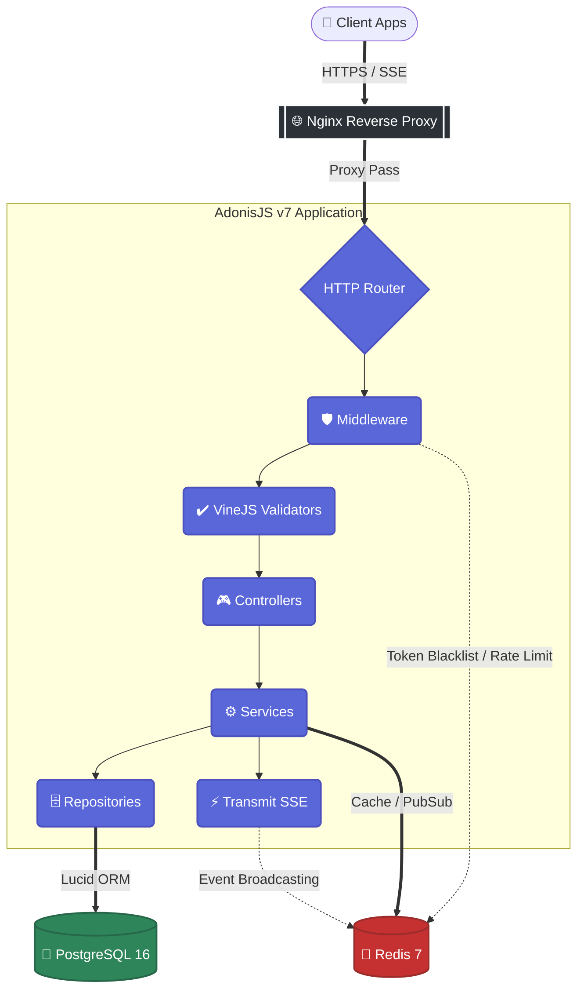

# 💬 ConvoCore

> Enterprise-grade, real-time multi-room chat API built with **AdonisJS 7**, **PostgreSQL**, **Redis**, and **SSE (Server-Sent Events)**.

## ✨ Features
- **Real-time Messaging**: Instant message delivery using Server-Sent Events (SSE).
- **Group & Direct Conversations**: Support for 1-on-1 and multi-user group chats.
- **Robust Authentication**: Custom JWT-based auth with access/refresh token rotation and guest sessions.
- **Presence & Typing Indicators**: See who is online and currently typing in real-time.
- **Read Receipts & Notifications**: Unread message tracking and global notification system.
- **Full-Text Search**: High-performance message and conversation search using PostgreSQL `tsvector`.
- **Media Uploads**: Secure image and file upload handling.
- **Enterprise Security**: Rate limiting, CORS, CSP headers, and token blacklisting via Redis.

## 🛠 Tech Stack
- **Framework**: [AdonisJS v7](https://adonisjs.com/) (TypeScript)
- **Database**: PostgreSQL 16 (via Lucid ORM)
- **Caching & Rate Limiting**: Redis 7
- **Real-time**: `@adonisjs/transmit` (SSE)
- **Authentication**: Custom JWT (JSON Web Tokens) with scrypt hashing
- **Validation**: VineJS
- **Containerization**: Docker & Docker Compose
- **Deployment**: Nginx, GitHub Actions (CI/CD)

---

## 📑 Table of Contents

- [Features](#-features)
- [Tech Stack](#-tech-stack)
- [Prerequisites](#-prerequisites)
- [Quick Start](#-quick-start)
- [Architecture](#-architecture)
- [Package Structure & Libraries](#-package-structure--libraries)
- [Complete API Guide](#-complete-api-guide)
  - [1. Authentication](#1--authentication)
  - [2. Conversations](#2--conversations)
  - [3. Messages](#3--messages)
  - [4. Notifications](#4--notifications)
  - [5. Presence & Typing](#5--presence--typing)
  - [6. Search](#6--search)
  - [7. File Uploads](#7--file-uploads)
  - [8. Real-time Events (SSE)](#8--real-time-events-sse)
- [Environment Variables](#-environment-variables)
- [Running Tests](#-running-tests)
- [Production Deployment](#-production-deployment)

---

## 📋 Prerequisites

| Tool | Version | Purpose |
|---|---|---|
| [Docker](https://docs.docker.com/get-docker/) | 20+ | Container runtime |
| [Docker Compose](https://docs.docker.com/compose/) | v2+ | Multi-container orchestration |
| [Git](https://git-scm.com/) | 2.30+ | Source control |
| [curl](https://curl.se/) / [Postman](https://www.postman.com/) | Any | API testing |

> **No need to install Node.js, PostgreSQL, or Redis** — everything runs inside Docker.

---

## 🚀 Quick Start

### Step 1 — Clone the repository

```bash
git clone https://github.com/codexankitsingh/ConvoCore.git
cd ConvoCore
```

### Step 2 — Create environment file

```bash
cp .env.example .env
```

### Step 3 — Generate secrets

Run these two commands and paste the output into your `.env` file:

```bash
# Generate APP_KEY (32-byte hex string)
node -e "console.log(require('crypto').randomBytes(32).toString('hex'))"

# Generate JWT_SECRET (64-byte base64 string)
openssl rand -base64 64
```

Open `.env` and fill in:

```env
APP_KEY=<paste-app-key-here>
JWT_SECRET=<paste-jwt-secret-here>
```

> **Important**: Also set `HOST=0.0.0.0` in `.env` so Docker's port mapping works correctly.

### Step 4 — Start all services

```bash
docker compose up -d
```

This spins up 4 containers:

| Container | Port | Description |
|---|---|---|
| `chat_app` | `3333` | AdonisJS API server (HMR mode) |
| `chat_postgres` | `5432` | PostgreSQL 16 database |
| `chat_redis` | `6379` | Redis 7 (tokens, rate limits, presence) |
| `chat_pgadmin` | `8080` | pgAdmin database GUI |

### Step 5 — Run database migrations

```bash
docker compose exec app node ace migration:run
```

### Step 6 — Verify it works

```bash
curl http://localhost:3333/health
```

Expected response:
```json
{
  "status": "ok",
  "service": "convocore-api",
  "version": "1.0.0",
  "environment": "development"
}
```

✅ **You're ready to go!**

---

## 🏗 Architecture



**Key Design Patterns:**
- **Controller → Service → Repository** layered architecture
- **Dependency Injection** via AdonisJS IoC container
- **Interface-based contracts** for all services and repositories
- **JWT authentication** with Redis-backed token lifecycle
- **Redis** for rate limiting, token blacklisting, and presence

---

## 📦 Package Structure & Libraries

The project follows a standard AdonisJS domain-driven directory structure:

```text
app/
├── controllers/    # HTTP layer: handles requests and returns responses
├── exceptions/     # Custom error handling and global exception handler
├── middleware/     # Request interceptors (Auth, Rate Limiting, Guards)
├── models/         # Lucid ORM data models and relationships
├── repositories/   # Data access layer (DB queries abstracting Lucid)
├── services/       # Core business logic and use cases
└── validators/     # VineJS schema validation rules
```

**Core Libraries Used:**
- `@adonisjs/core`: Web framework foundation and IoC container.
- `@adonisjs/lucid`: Powerful SQL ORM and query builder for PostgreSQL.
- `@adonisjs/redis`: Redis client for caching, rate limiting, and pub/sub.
- `@adonisjs/transmit`: Server-Sent Events (SSE) provider for real-time broadcasting.
- `@vinejs/vine`: Fast, schema-based data validation.
- `jsonwebtoken`: Standard library for creating and verifying JWTs.

---

## 📖 Complete API Guide

> **Base URL**: `http://localhost:3333/api/v1`  
> **Auth Header**: `Authorization: Bearer <accessToken>` (required on all routes except register/login/guest)

---

### 1. 🔐 Authentication

#### Register a new user

```bash
curl -X POST http://localhost:3333/api/v1/auth/register \
  -H "Content-Type: application/json" \
  -d '{
    "name": "Ankit Singh",
    "email": "ankit@example.com",
    "password": "password123"
  }'
```

**Response** (201):
```json
{
  "message": "Account created successfully",
  "data": {
    "user": {
      "id": "uuid-here",
      "name": "Ankit Singh",
      "email": "ankit@example.com",
      "isGuest": false
    },
    "tokens": {
      "accessToken": "eyJhbG...",
      "refreshToken": "eyJhbG...",
      "expiresIn": 900
    }
  }
}
```

> 💡 **Save the `accessToken`** — you'll need it for all subsequent requests.  
> The access token expires in **15 minutes**. Use the refresh token to get a new one.

#### Login

```bash
curl -X POST http://localhost:3333/api/v1/auth/login \
  -H "Content-Type: application/json" \
  -d '{
    "email": "ankit@example.com",
    "password": "password123"
  }'
```

#### Create a guest user (no email/password required)

```bash
curl -X POST http://localhost:3333/api/v1/auth/guest \
  -H "Content-Type: application/json" \
  -d '{"name": "Guest User"}'
```

#### Get current user profile

```bash
curl http://localhost:3333/api/v1/auth/me \
  -H "Authorization: Bearer <accessToken>"
```

#### Refresh access token

```bash
curl -X POST http://localhost:3333/api/v1/auth/refresh \
  -H "Content-Type: application/json" \
  -d '{"refreshToken": "<refreshToken>"}'
```

#### Logout (blacklists the token)

```bash
curl -X POST http://localhost:3333/api/v1/auth/logout \
  -H "Authorization: Bearer <accessToken>"
```

---

### 2. 💬 Conversations

#### Create a direct conversation (1-on-1)

First, register a second user, then create a conversation between them:

```bash
# Register User B
curl -X POST http://localhost:3333/api/v1/auth/register \
  -H "Content-Type: application/json" \
  -d '{
    "name": "User B",
    "email": "userb@example.com",
    "password": "password123"
  }'
# Note User B's ID from the response

# Create direct conversation (use User A's token)
curl -X POST http://localhost:3333/api/v1/conversations \
  -H "Authorization: Bearer <userA-accessToken>" \
  -H "Content-Type: application/json" \
  -d '{
    "type": "direct",
    "participantIds": ["<userB-id>"]
  }'
```

#### Create a group conversation

```bash
curl -X POST http://localhost:3333/api/v1/conversations \
  -H "Authorization: Bearer <accessToken>" \
  -H "Content-Type: application/json" \
  -d '{
    "type": "group",
    "name": "Project Team",
    "participantIds": ["<userB-id>", "<userC-id>"]
  }'
```

#### List all your conversations

```bash
curl http://localhost:3333/api/v1/conversations \
  -H "Authorization: Bearer <accessToken>"
```

#### Get a specific conversation

```bash
curl http://localhost:3333/api/v1/conversations/<conversationId> \
  -H "Authorization: Bearer <accessToken>"
```

#### Add a participant to a group

```bash
curl -X POST http://localhost:3333/api/v1/conversations/<conversationId>/participants \
  -H "Authorization: Bearer <accessToken>" \
  -H "Content-Type: application/json" \
  -d '{"userId": "<newUserId>"}'
```

#### Remove a participant from a group

```bash
curl -X DELETE http://localhost:3333/api/v1/conversations/<conversationId>/participants/<userId> \
  -H "Authorization: Bearer <accessToken>"
```

#### Delete a conversation

```bash
curl -X DELETE http://localhost:3333/api/v1/conversations/<conversationId> \
  -H "Authorization: Bearer <accessToken>"
```

---

### 3. ✉️ Messages

#### Send a message

```bash
curl -X POST http://localhost:3333/api/v1/conversations/<conversationId>/messages \
  -H "Authorization: Bearer <accessToken>" \
  -H "Content-Type: application/json" \
  -d '{"content": "Hello from ConvoCore! 🚀"}'
```

#### List messages in a conversation

```bash
# Basic — returns latest messages
curl http://localhost:3333/api/v1/conversations/<conversationId>/messages \
  -H "Authorization: Bearer <accessToken>"

# With pagination
curl "http://localhost:3333/api/v1/conversations/<conversationId>/messages?page=1&limit=20" \
  -H "Authorization: Bearer <accessToken>"
```

#### Edit a message

```bash
curl -X PATCH http://localhost:3333/api/v1/conversations/<conversationId>/messages/<messageId> \
  -H "Authorization: Bearer <accessToken>" \
  -H "Content-Type: application/json" \
  -d '{"content": "Updated message content"}'
```

#### Delete a message (soft delete)

```bash
curl -X DELETE http://localhost:3333/api/v1/conversations/<conversationId>/messages/<messageId> \
  -H "Authorization: Bearer <accessToken>"
```

#### Mark messages as read

```bash
curl -X POST http://localhost:3333/api/v1/conversations/<conversationId>/messages/read \
  -H "Authorization: Bearer <accessToken>"
```

---

### 4. 🔔 Notifications

#### Get all notifications

```bash
curl http://localhost:3333/api/v1/notifications \
  -H "Authorization: Bearer <accessToken>"
```

#### Get unread count

```bash
curl http://localhost:3333/api/v1/notifications/unread-count \
  -H "Authorization: Bearer <accessToken>"
```

#### Mark a single notification as read

```bash
curl -X PATCH http://localhost:3333/api/v1/notifications/<notificationId>/read \
  -H "Authorization: Bearer <accessToken>"
```

#### Mark all notifications as read

```bash
curl -X PATCH http://localhost:3333/api/v1/notifications/read-all \
  -H "Authorization: Bearer <accessToken>"
```

#### Delete a notification

```bash
curl -X DELETE http://localhost:3333/api/v1/notifications/<notificationId> \
  -H "Authorization: Bearer <accessToken>"
```

---

### 5. 🟢 Presence & Typing

#### Go online

```bash
curl -X POST http://localhost:3333/api/v1/presence/online \
  -H "Authorization: Bearer <accessToken>"
```

#### Go offline

```bash
curl -X POST http://localhost:3333/api/v1/presence/offline \
  -H "Authorization: Bearer <accessToken>"
```

#### Send typing indicator

```bash
curl -X POST http://localhost:3333/api/v1/presence/typing \
  -H "Authorization: Bearer <accessToken>" \
  -H "Content-Type: application/json" \
  -d '{"conversationId": "<conversationId>"}'
```

#### Check who's online in a conversation

```bash
curl http://localhost:3333/api/v1/presence/<conversationId> \
  -H "Authorization: Bearer <accessToken>"
```

---

### 6. 🔍 Search

#### Search messages

```bash
curl "http://localhost:3333/api/v1/search/messages?q=hello" \
  -H "Authorization: Bearer <accessToken>"
```

#### Search conversations

```bash
curl "http://localhost:3333/api/v1/search/conversations?q=project" \
  -H "Authorization: Bearer <accessToken>"
```

#### Global search (messages + conversations)

```bash
curl "http://localhost:3333/api/v1/search?q=hello" \
  -H "Authorization: Bearer <accessToken>"
```

---

### 7. 📁 File Uploads

#### Upload an image

```bash
curl -X POST http://localhost:3333/api/v1/uploads/image \
  -H "Authorization: Bearer <accessToken>" \
  -F "image=@/path/to/photo.jpg"
```

#### Upload a file

```bash
curl -X POST http://localhost:3333/api/v1/uploads/file \
  -H "Authorization: Bearer <accessToken>" \
  -F "file=@/path/to/document.pdf"
```

#### Get file info

```bash
curl http://localhost:3333/api/v1/uploads/<fileId> \
  -H "Authorization: Bearer <accessToken>"
```

#### Delete an upload

```bash
curl -X DELETE http://localhost:3333/api/v1/uploads/<fileId> \
  -H "Authorization: Bearer <accessToken>"
```

---

### 8. 📡 Real-time Events (SSE)

ConvoCore uses **Server-Sent Events (SSE)** via `@adonisjs/transmit` for real-time updates. Clients subscribe to channels and receive live events.

#### Channel patterns

| Channel | Events |
|---|---|
| `conversations/<id>` | New messages, edits, deletes |
| `users/<id>/notifications` | New notifications |
| `conversations/<id>/presence` | Online/offline, typing indicators |

#### Get real-time connection info

```bash
curl http://localhost:3333/api/v1/realtime/info \
  -H "Authorization: Bearer <accessToken>"
```

#### Connect via EventSource (JavaScript)

```javascript
const token = 'your-access-token'

// Connect to SSE
const eventSource = new EventSource(
  `http://localhost:3333/__transmit/events?token=${token}`
)

// Subscribe to a conversation channel
fetch('http://localhost:3333/__transmit/subscribe', {
  method: 'POST',
  headers: {
    'Content-Type': 'application/json',
    'Authorization': `Bearer ${token}`
  },
  body: JSON.stringify({
    channel: 'conversations/your-conversation-id'
  })
})

// Listen for events
eventSource.onmessage = (event) => {
  const data = JSON.parse(event.data)
  console.log('Real-time event:', data)
}
```

---

## 🔧 Environment Variables

| Variable | Required | Default | Description |
|---|---|---|---|
| `APP_KEY` | ✅ | — | Encryption key (32-byte hex) |
| `JWT_SECRET` | ✅ | — | JWT signing secret (64-byte base64) |
| `HOST` | ✅ | `0.0.0.0` | Server bind address |
| `PORT` | ✅ | `3333` | Server port |
| `NODE_ENV` | ✅ | `development` | Environment mode |
| `DB_HOST` | ✅ | `postgres` | PostgreSQL host |
| `DB_PORT` | ✅ | `5432` | PostgreSQL port |
| `DB_USER` | ✅ | `postgres` | PostgreSQL user |
| `DB_PASSWORD` | ✅ | `postgres` | PostgreSQL password |
| `DB_DATABASE` | ✅ | `chat_app` | PostgreSQL database name |
| `REDIS_HOST` | ✅ | `redis` | Redis host |
| `REDIS_PORT` | ✅ | `6379` | Redis port |
| `REDIS_PASSWORD` | ✅ | — | Redis password |
| `JWT_ACCESS_EXPIRES_IN` | — | `15m` | Access token TTL |
| `JWT_REFRESH_EXPIRES_IN` | — | `7d` | Refresh token TTL |

---

## 🧪 Running Tests

ConvoCore has **52 integration tests** covering auth, conversations, messages, notifications, and security.

```bash
# Run all integration tests
docker compose exec app node ace test integration

# Run a specific test file
docker compose exec app node ace test integration --files="auth"
```

---

## 🚀 Production Deployment

```bash
# Use the production Docker Compose file
docker compose -f docker-compose.prod.yml up -d

# Run migrations
docker compose -f docker-compose.prod.yml exec app node build/ace migration:run --force
```

Production includes:
- **Nginx** reverse proxy with SSL (Certbot auto-renewal)
- **Non-root** container user
- **Health checks** at Docker, Nginx, and app levels
- **CI/CD** via GitHub Actions (test → build → deploy)

---

## 🗂 Complete API Reference

| Method | Endpoint | Auth | Description |
|---|---|---|---|
| `GET` | `/health` | ❌ | Health check |
| **Auth** | | | |
| `POST` | `/api/v1/auth/register` | ❌ | Register user |
| `POST` | `/api/v1/auth/login` | ❌ | Login |
| `POST` | `/api/v1/auth/guest` | ❌ | Create guest session |
| `POST` | `/api/v1/auth/refresh` | ❌ | Refresh access token |
| `POST` | `/api/v1/auth/logout` | ✅ | Logout (blacklist token) |
| `GET` | `/api/v1/auth/me` | ✅ | Current user profile |
| **Conversations** | | | |
| `POST` | `/api/v1/conversations` | ✅ | Create conversation |
| `GET` | `/api/v1/conversations` | ✅ | List conversations |
| `GET` | `/api/v1/conversations/:id` | ✅ | Get conversation |
| `DELETE` | `/api/v1/conversations/:id` | ✅ | Delete conversation |
| `POST` | `/api/v1/conversations/:id/participants` | ✅ | Add participant |
| `DELETE` | `/api/v1/conversations/:id/participants/:userId` | ✅ | Remove participant |
| **Messages** | | | |
| `POST` | `/api/v1/conversations/:id/messages` | ✅ | Send message |
| `GET` | `/api/v1/conversations/:id/messages` | ✅ | List messages |
| `PATCH` | `/api/v1/conversations/:id/messages/:messageId` | ✅ | Edit message |
| `DELETE` | `/api/v1/conversations/:id/messages/:messageId` | ✅ | Delete message |
| `POST` | `/api/v1/conversations/:id/messages/read` | ✅ | Mark as read |
| **Notifications** | | | |
| `GET` | `/api/v1/notifications` | ✅ | List notifications |
| `GET` | `/api/v1/notifications/unread-count` | ✅ | Unread count |
| `PATCH` | `/api/v1/notifications/:id/read` | ✅ | Mark one read |
| `PATCH` | `/api/v1/notifications/read-all` | ✅ | Mark all read |
| `DELETE` | `/api/v1/notifications/:id` | ✅ | Delete notification |
| **Presence** | | | |
| `POST` | `/api/v1/presence/online` | ✅ | Go online |
| `POST` | `/api/v1/presence/offline` | ✅ | Go offline |
| `POST` | `/api/v1/presence/typing` | ✅ | Typing indicator |
| `GET` | `/api/v1/presence/:conversationId` | ✅ | Presence status |
| **Search** | | | |
| `GET` | `/api/v1/search?q=` | ✅ | Global search |
| `GET` | `/api/v1/search/messages?q=` | ✅ | Search messages |
| `GET` | `/api/v1/search/conversations?q=` | ✅ | Search conversations |
| **Uploads** | | | |
| `POST` | `/api/v1/uploads/image` | ✅ | Upload image |
| `POST` | `/api/v1/uploads/file` | ✅ | Upload file |
| `GET` | `/api/v1/uploads/:fileId` | ✅ | Get upload info |
| `DELETE` | `/api/v1/uploads/:fileId` | ✅ | Delete upload |
| **Real-time** | | | |
| `GET` | `/api/v1/realtime/info` | ✅ | SSE connection info |

---

## 📄 License

MIT

